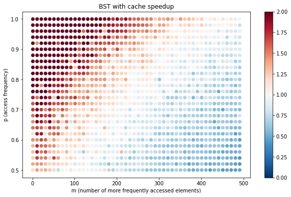

# Splay tree performance

Splay trees are known to have good theoretical amortized runtime complexity when querying certain objects
more often. Since queried nodes are moved to the top of the tree, the idea is that this automatic restructuring
mechanism "caches" these nodes for future look-ups, as well as giving the splay tree a sort of self-balancing
behavior.

The benchmark here shows the relative speedup compared to a regular binary search tree.
Disclaimer: this is a casual implementation just for fun.

I wanted to test the following scenario: Suppose we have `n` total elements, but know ahead of time
that there are `m` elements which are accessed more frequently than the rest.

We generate `n` unique numbers and partition them into 2 groups, `A` & `B` with `n-m` & `m` elements.

To generate a query:
1. Flip a weighted coin with P(head) = `1-p`, and P(tail) = `p`, where 0 <= `p` <= 1.
2. If heads, pick a random element of `A`. Otherwise, pick a random element of `B`.

The 2 parameters we can adjust are `m` and `p`. Intuitively the speedup using
a splay tree vs BST should decrease in `m` and increase in `p`.

Here's a plot of the runtime speedup (BST runtime / splaytree runtime) for `n` = 10,000 elements,
1 <= `m` < 50, 0.5 <= `p` <= 1, with 100,000 queries for each parameter combination.

As shown, our prediction is correct, and we do get a speedup over a normal BST in a certain parameter region.
But this region seems really small - to even have a chance of outperforming the BST,
`m` has to be at most 6, which is 0.06% the size of `n`!

Since `m` has to be tiny, I also implemented a kind of naive method of pre-querying
the elements of `B` and caching the results in an array, which has O(`m`) lookup time for queries into `B`.

Our intuition is the same, a larger `m` and smaller `p` decreases the effectiveness of the cache.
But in this case the transition boundary is much farther out and our speedup region is way bigger.

### Why such a big difference?
I haven't looked into the low level code, so I can only speculate. Perhaps part of the reason is that the
current splay tree implementation always splays during a query. So elements of `B` that have been splayed
before which are queried later and are already close the root still get splayed anyways. If we splay less often,
then we could avoid a larger percentage of overhead proportional to `p`.
